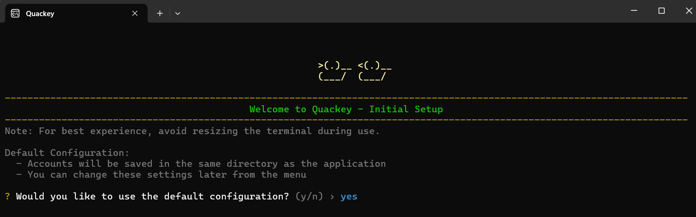
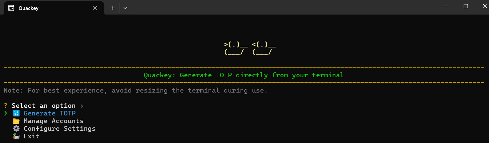
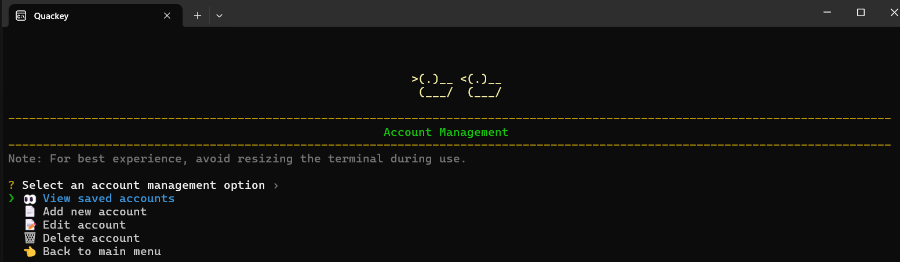
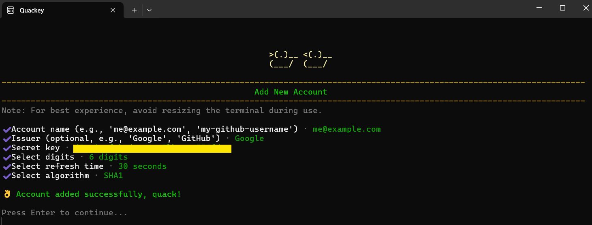
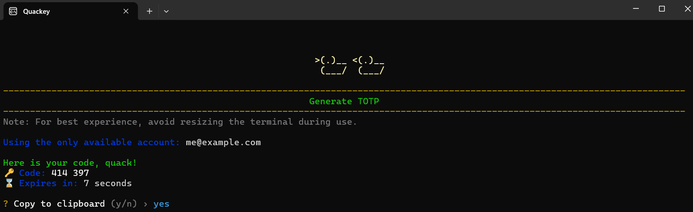

# Quackey - TOTP Generator

A Time-based One-Time Password (TOTP) generator application that allows you to store and generate TOTP codes for various accounts directly from your terminal.

## Features

- 🎨 Intuitive terminal user interface
- 🔄 Support for multiple TOTP algorithms (SHA1, SHA256, SHA512)
- ⚙️ Configurable TOTP parameters (digits, period)
- 📝 Account management (add, edit, delete)
- 📊 Real-time TOTP code generation
- 📋 Copy code to clipboard
- 🔍 Easy account selection and viewing
- 📂 Customizable storage location
- 📝 Comprehensive logging

## Installation

### Prerequisites

- Rust (latest stable version)
- Git

### Building from Source

1. Clone the repository:

    ```bash
    git clone https://github.com/dennexequiel/quackey.git
    cd quackey
    ```

2. Build the project:

    ```bash
    cargo build --release
    ```

3. The executable will be available in `target/release/quackey`

## Usage

For detailed usage instructions, please refer to our [Usage Guide](docs/USAGE_GUIDE.md).

### Quick Start

1. Run the application:

    ```bash
    ./quackey
    ```

2. On first run, you'll be prompted to configure the application:

   - Choose between default configuration or custom storage location
   - The application will create necessary directories and files

3. Main Menu Options:
   - 🔢 Generate TOTP: Generate codes for your accounts
   - 📂 Manage Accounts: Add, edit, or delete accounts
   - ⚙️ Configure Settings: Change storage location
   - 🦆 Exit: Close the application

## Configuration

- The application stores its configuration in `config.json`, located in the application directory.
- Logs are written to `totp_app.log`, also located in the application directory.
- `accounts.json` is used to store account data. By default, it is saved in the application directory unless a custom path is provided during the initial setup or changed later via the configuration settings.

## Security

- TOTP secrets are stored locally on your machine
- No data is transmitted over the network

## Screenshots


*Initial Setup - Configure storage location and create necessary files*


*Main Menu - Navigate using arrow keys and Enter*

 
*Account Management - Add, edit, view and delete accounts*


*Add New Account - Configure TOTP parameters and enter account details*


*Generate Code - Generate TOTP and copy to clipboard*

## Contributing

Contributions are welcome! Please feel free to submit a Pull Request.

## License

This project is licensed under the MIT License - see the [LICENSE](LICENSE) file for details.

## Acknowledgments

- Built with Rust
- Uses the `totp-rs` crate for TOTP generation
